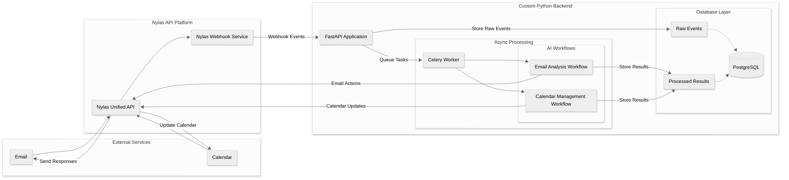
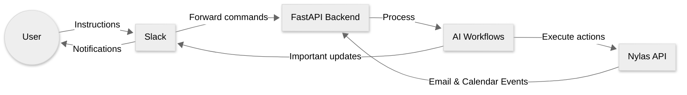

# AI Executive Assistant

## Introduction

This project creates a personal AI assistant focused on email and calendar management, inspired by Dan Martell's business book "Buy Back Your Time." The core philosophy is that managing your inbox and calendar are among the first tasks entrepreneurs should delegate as their workload grows. With modern AI capabilities, we can now create an AI executive assistant to handle these responsibilities effectively.

The AI Executive Assistant monitors your inbox, processes emails intelligently, and manages calendar events automatically - freeing up your valuable time to focus on strategic priorities.

## Why Nylas?

This project leverages the [Nylas API platform](https://www.nylas.com/) for several key advantages:

- **Unified API**: Nylas provides a single API to connect with Gmail, Outlook, Exchange, and other email/calendar providers
- **Authentication Handling**: Nylas manages OAuth flows and credential refreshing
- **Webhooks**: Real-time notifications for email and calendar events
- **Future Flexibility**: Easily switch email providers without changing your application code

Using Nylas significantly reduces development time and complexity compared to building direct integrations with multiple email and calendar services.

## Project Benefits

Beyond creating a useful tool, this project demonstrates fundamental concepts for building end-to-end AI applications:

1. **System Integration**: Monitoring incoming data via webhooks
2. **Data Storage**: Organizing and persisting information
3. **AI Processing**: Analyzing content with AI models
4. **Closed-Loop Functionality**: Taking actions based on AI decisions

This foundation not only teaches the core components of practical AI applications but also creates an extensible platform that community members can enhance with additional tools and capabilities.

## Architecture Overview

## Slack Interaction Layer

